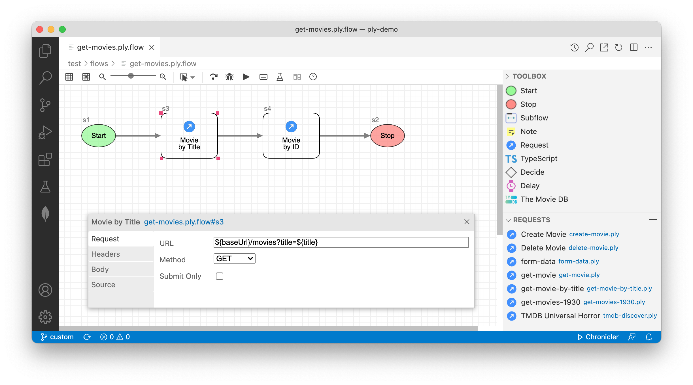
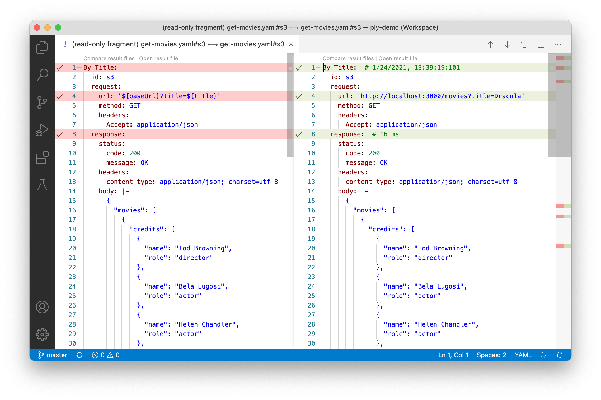

<h1>Friendly API Autotesting</h1>

Ply is simply a more intuitive way of automating REST and GraphQL API tests.

<h2>Graphical, flow-driven test suites</h2>

<h2 style="margin-top:-15px">Visual, side-by-side results</h2>

We aim to make it easy . Here are Ply's chief selling points at a glance.

<ol style="text-align:left;">
  <li>Something here</li>
  <li>Something else here</li>
  <li>Lastly something here</li>
</ol>

## TODO

## Features
Test Explorer sidebar shows all Ply requests/cases/suites along with their statuses
CodeLens segments in your Ply test files for running tests and debugging cases
Gutter decorations on your Ply test files showing test statuses
Test log displayed in Output view when a test is selected in Test Explorer
Diff editor for comparing expected/actual results, with smart decorations aware of runtime values
Import Ply requests from Postman collections

---
##### * - <a href="https://www.merriam-webster.com/">Merriam-Webster’s Collegiate Dictionary</a>, Tenth Edition
