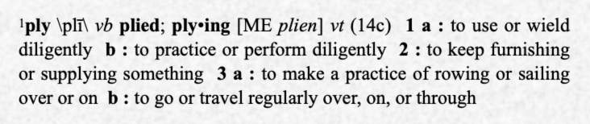

<h1>Friendly API Autotesting

  
  <a href="#---merriam-websters-collegiate-dictionary-tenth-edition">*</a>

</h1>

Ply is simply a more intuitive way of automating REST and GraphQL API tests.

## Visual, side-by-side results

We aim to Our aim is to make it easy . Here are Ply's chief selling points at a glance.

1. Something here
1. Something else here
1. Lastly something here

## Autotesting capabilities

|                     |Ply                     |Postman                 |Insomnia                |REST-Assured            |SOAtest                 |ReadyAPI                 |
|:---------------------|:----------------------:|:----------------------:|:----------------------:|:----------------------:|:----------------------:|:----------------------:|
|Open Source           |✓|✗|✓|✓|✗|✗|
|Graphical Flows       |✓|✗|✗|✗|✗|✗|
|Side-by-Side Results  |✓|✗|✗|✗|✗|✗|
|Auto-Generate Results |✓|✗|✗|✗|✗|✗|
|GraphQL Support       |✓|✓|✓|✗|✗|✓|
|Dynamic Values        |✓|✓|✓|✓|✓|✓|
|Previous Response Vals|✓|✓|✓|✓|✓|✓|
|Regular Expressions   |✓|✓|✓|✓|✓|✓|
|Low Code              |✓|✗|✗|✗|✗|✗|
|Import from Postman   |✓|-|✓|✗|✓|✓|
|Expect/Assert         |✓|✓|✓|✓|✓|✓|
|VS Code Extension     |✓|✓|✗|✗|✗|✗|

Start with a YAML file describing your requests. Run Ply to submit these requests and compare actual results against expected, with template literal placeholders for dynamic values. The Ply extension gives you a side-by-side diff view so you can compare results at a glance.

  

Checkmarks indicate diff lines that're okay, such as substituted values or comments; whereas Xs indicate significant differences causing test failure(s).

When you need greater control, Ply cases give you programmatic access via TypeScript to supplement this built-in expected/actual verification.

## Features
Test Explorer sidebar shows all Ply requests/cases/suites along with their statuses
CodeLens segments in your Ply test files for running tests and debugging cases
Gutter decorations on your Ply test files showing test statuses
Test log displayed in Output view when a test is selected in Test Explorer
Diff editor for comparing expected/actual results, with smart decorations aware of runtime values
Import Ply requests from Postman collections

## Compare to Postman

<table>
<thead>
<tr>
<th>Feature</th>
<th>Ply</th>
<th>Postman</th>
</tr>
</thead>
<tbody>
<tr>
<td>Graphical Result Comparison</td>
<td>Yes</td>
<td>No</td>
</tr>
<tr>
<td>Graphical Orchestration of APIs</td>
<td>Yes</td>
<td>No</td>
</tr>

</tbody>
</table>

---
##### * - <a href="https://www.merriam-webster.com/">Merriam-Webster’s Collegiate Dictionary</a>, Tenth Edition
