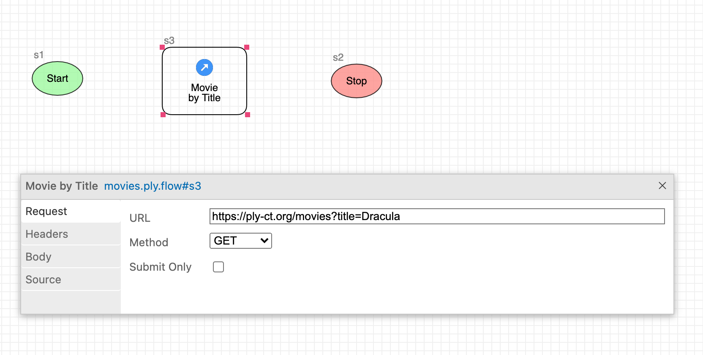
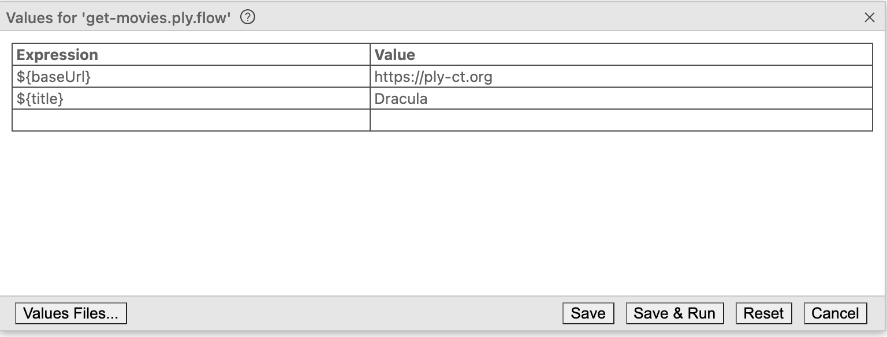
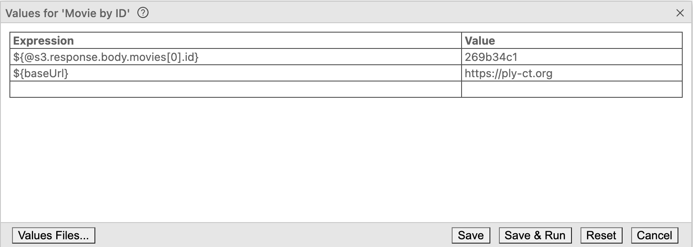

# Ply Flows

## Create a Ply flow
1. Launch VS Code, and in its Activity Bar click the Test Explorer icon:
   
1. Drop down Test Explorer's meatball menu
   <span class="after-icon">, then select "New Ply Flow".</span>
1. Name the flow "get-movies.ply.flow", saving to an empty folder somewhere.
1. Your newly-created flow should appear containing two steps: Start and Stop:  
   
1. Expand the Flows group in Test Explorer, and you should see get-movies.ply.flow.

## Run your flow
1. In Ply's flow diagram toolbar (or in the Test Explorer item hover menu), click the run icon:
     
   When prompted, select "Submit without verifying" (*Submit* is Ply-speak for "don't check run results").
1. To show flow/step statuses, the diagram automatically switches to Inspect mode, indicated by this icon in the toolbar mode dropdown:
   
1. So far our flow doesn't do anything interesting. However, this illustrates a couple of points:
   - In Inspect mode, each step that executed is drawn with a heavy border around it:  
   
   - VS Code's output window shows what happened:
     ```
     Running flow 'get-movies.ply.flow'
     Executing step: "s1"
     Executing step: "s2"
     Finished flow: "1770df52bde"     
     ```

## Add a Request step to your flow
The idea of Ply is to test an API by submitting HTTP requests and validating results. That's where Request steps come in.
1. Switch back to Select mode using the flow toolbar dropdown:
   
1. Remove the link joining Start to Stop by selecting it and hitting the Delete key.
1. From Ply's toolbox view to the right of our diagram, drag in the step that's labeled *Request*. Position it somewhere
   between Start and Stop.
1. Double-click on the "New Request" label to rename it "Movie by Title".
1. If you double-click on the Request step somewhere other than its label, Ply Configurator pops up. After renaming, double-click "Movie by Title"
   (or right-click and select Configure). Then enter this for its URL:   
     
   This points to [ply-movies](https://github.com/ply-ct/ply-movies#readme), Ply's playground REST API containing a few hundred horror movies
   from the 1930s.

## Draw links between flow steps
1. To draw new links, switch to Connect mode:
     
1. Then click/drag your mouse to draw a link between Start and "Movie by Title".
1. Do the same between "Movie by Title" and Stop.
1. Switch back to Select mode, and save your flow (File > Save File, or Ctrl/Cmd-S).

## Run with expected results
1. Click the Run icon again to execute your flow. This time when prompted, select "Create expected result from actual".
1. Notice that this time, the Output view displays a line saying: Request 's3' PASSED. What actually happened was that Ply
   executed get-movies.ply.flow, created actual runtime results, and then copied those results to create an expected-results
   file before comparing.
1. Double-click the "Movie by Title" step to inspect its Request and Response.
1. Run your flow again - you won't get prompted since expected results now exist. This time the flow fails, and "Movie by Title"
   is bordered in red.
1. To understand why the test failed, right-click on "Movie by Title" and select "Compare Results":  
     
   VS Code's diff editor indicates there are a few discrepancies between expected (on the left) versus actual (on the right)
   results. Lines 1 and 7 both differ, but these differences are only comments; hence the checkmark in
   the left gutter of the editor. However, line 15 has a significant difference in 'date' header values.
1. To fix this, scroll to the top of the (left-hand) expected editor, and click the [Code Lens](https://code.visualstudio.com/blogs/2017/02/12/code-lens-roundup)
   labeled "Open result file". (The full expected-results file includes outcomes for Start and Stop, so the line numbers are different from 
   the "Movie by ID" result fragment.) Remove the 'date' header (all of line 18). In fact, remove these header lines as well:
     - connection
     - content-length
     - etag
     - server
     - x-powered-by

   You're left with just 'content-type', which is the only response header we care about matching. When Ply submits a request, for
   comparison it captures just those response headers that appear in expected results. This makes it convenient to exclude unimportant headers.
1. Save and close the expected results and comparison editors; then re-run get-movies.ply.flow. This time it should succeed.

## Use input values in a flow
[Values](values) let you externalize parts of your requests and results, making them dynamic as well as reusable. For example: you might want to run
"get-movies.ply.flow" against different environments, so you'd parameterize its request URLs using values.
1. Switch back to Select mode
1. Configure the "Movie by Title" step by double-clicking, or by right-clicking and selecting "Configure".
1. On the Request tab, change the URL to this: 
1. Now save and run the flow again. You'll be prompted to enter `${baseUrl}` and `${title}`. Enter values as shown here and click Run.  
     

The value for "title" is available to reference in any of your requests. If you run the flow again, Ply will remember to use "Dracula" for `${title}`
and you won't be bothered with a prompt. Try running with a different value:
1. In the flow diagram toolbar, click the Values button:
     
1. Instead of "Dracula", enter "Frankenstein" for `${title}`; then click Run.
1. Right-click on the failed step and select Compare Results to see how the response compares for a different title.
1. Click the Values toolbar button again to switch back to "Dracula" and confirm that Run succeeds.

You can also define a flow-wide value as part of the flow itself:
1. Open the configurator at flow-level by double-clicking or right-clicking a blank spot on the canvas.
1. Add a value named "title" and again set it to "Dracula"  
     
This technique provides a fixed value that's available to anyone running your flow without them having to enter it.  

### Food for thought:
 Why is "baseUrl" not a good candidate to specify in a flow definition this way?

## Reference previous results in a downstream step
Suppose we add a request in our flow to test a slightly different endpoint.
1. Drag another Request step onto the canvas and label it "Movie by ID".
1. Link it downstream of the "Movie by Title" request.
1. We know Dracula's `id` from our previous request, so enter this URL:   
     
1. Now save and run get-movies.ply.flow. The new step will fail since we haven't added it's expected results.
1. Right-click on "Movie by ID" and select "Compare Results". The expected result (on the left) is empty.
   Select all lines in the actual result on the right and copy to the clipboard.
1. Now click the "Open Result File" Code Lens in **expected** result, and paste everything right before the Stop step near the bottom.
   As before, edit the response headers to include only 'content-type'.
1. Run the flow again, and it should succeed. You may need to iterate a time or two to make things work.

There's an obvious drawback here in our hardcoding of `id` in "Movie by ID". We can avoid hardcoding using an expression 
that references our previous "Movie by Title" response.
1. Reconfigure "Movie by ID" step to specify its request URL like this: 
   An expression that starts with `${@` is Ply's special syntax for referring to previous requests/responses. Here we're grabbing the 
   's3' ("Movie by Title") step's response body, indexing to the zeroth element of the movies array, and getting its `id` value. 
   So effectively our flow is testing that the same movie we retrieved by title can also be retrieved by its ID.
1. In fact, it's a good idea to change the expected result for "Movie by ID" to also use dynamic placeholders for `url` and `id`:
   ```yaml
   Movie by ID:
     id: s4
     request:
       url: '${baseUrl}/movies/${@s3.response.body.movies[0].id}'
       method: GET
       headers: {}
     response:
       status:
         code: 200
         message: OK
       headers:
         content-type: application/json; charset=utf-8
       body: |-
         {
           "credits": [
             {
               "name": "Tod Browning",
               "role": "director"
             },
             {
               "name": "Bela Lugosi",
               "role": "actor"
             },
             {
               "name": "Helen Chandler",
               "role": "actor"
             },
             {
               "name": "David Manners",
               "role": "actor"
             },
             {
               "name": "Dwight Frye",
               "role": "actor"
             },
             {
               "name": "Edward Van Sloan",
               "role": "actor"
             }
           ],
           "description": "What's even more amazing than Lugosi's out-of-body performance is the fact that the finest horror movie ever made was filmed within 2 years of the advent of talking pictures.",
           "id": "${@s3.response.body.movies[0].id}",
           "poster": "drac.jpg",
           "rating": 5,
           "title": "Dracula",
           "webRef": {
             "ref": "tt0021814",
             "site": "imdb.com"
           },
           "year": 1931
         }
     status: 200
     message: OK
   ``` 

## Run a step by itself
As you're building out a Ply flow by adding new requests, sometimes you may want to run a single step in isolation
to test it without running the whole flow. Let's run the "Movie by ID" step that we just inserted.
1. Open get-movies.ply.flow in Select mode.
1. Right-click on "Movie by ID", and select Run.
1. This time when you're prompted for values, you'll observe that `${@s3.response.body.movies[0].id}` is required,
   and that Ply knows this value from our previous flow run.  
     
1. Double-click "Movie by ID" to review its request and response to make sure they're as expected.
     

Next Topic: [Requests](requests)