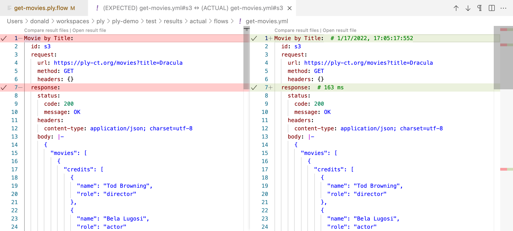

## Ply Flows Quickstart
If you want to get straight to building Ply test flows in less than 10 minutes, this guide is for you.

If you already know your way around npm and vscode, you may want to skip to [Install Ply](install-ply) 
or [VS Code Ply](vscode-ply).

## Prerequisites
1. Install Node.js:
   <https://nodejs.org/en/download/>
1. Install Visual Studio Code:
   <https://code.visualstudio.com/download>
1. Install the Ply VS Code extension:
   - Run Visual Studio Code
   - In the Activity Bar on the left, click the Extensions icon: 
     
   - Search for "Ply", and click its `Install` button.

## Create a workspace folder for your Ply flows
1. Launch VS Code if not already running.
1. From the menu: File > Add Folder to Workspace..., then select and/or create a folder.
1. Click the Explorer icon in VS Code's Activity Bar:
   
1. Right-click on your workspace folder, select New Folder, and create a subfolder named "flows".

## Create a new flow
1. In the Explorer tree, right-click on the "flows" folder you just created and select New File.
1. Name the file "get-movies.ply.flow" (.ply.flow is the default flowFiles extension, which can be modified in [Config](config));
1. Your newly-created flow should appear containing two steps: Start and Stop:  
   
1. In the Activity Bar, click on the Test Explorer icon:
   
1. Expand the Flows group, and you should see get-movies.ply.flow along with its steps in the tree.

## Run your flow
1. In Ply's flow diagram toolbar (or in the Test Explorer item hover menu), click the run icon:
     
   When prompted, select "Submit without verifying" (Submit is Ply-speak for "don't check run results").
1. To show flow/step statuses, the diagram automatically switches to Inspect mode, indicated by the check icon in the toolbar:
   
1. So far our flow doesn't really do anything interesting. However, this does illustrate a couple of points:
   - In Inspect mode, each step that executed is drawn with heavy border around it:  
   
   - VS Code's output window shows what happened:
     ```
     Running flow 'get-movies.ply.flow'
     Executing step: "s1"
     Executing step: "s2"
     Finished flow: "1770df52bde"     
     ```

## Add a Request step to your flow
The idea of Ply is to test an API by submitting HTTP requests and validating results. That's where Request steps come in.
1. Switch back to Select mode by clicking on its icon in the toolbar:
   
1. Remove the link joining Start to Stop by selecting it and hitting the Delete key.
1. From Ply's toolbox view to the right of our diagram, drag in the step that's labeled *Request*. Position it somewhere
   between Start and Stop.
1. Double-click on this "New Request" step to rename it "Get Dracula" (it should adopt a blue background, enabling you edit its name).
1. You'll notice that Ply Configurator also popped up when you double clicked. After renaming, select "Get Dracula" again so that 
   it shows up in Configurator. Then enter this for its URL:   
     
   This points to [ply-movies](https://github.com/ply-ct/ply-movies#readme), Ply's sample API containing hundreds of horror movies
   from the 1930s.

## Draw links between flow steps
1. To draw new links, switch to Connect mode:
     
1. Then click/drag your mouse to draw a link between Start and "Get Dracula".
1. Do the same between "Get Dracula" and Stop.
1. Switch back to Select mode, and save your flow (File > Save File, or Ctrl/Cmd-S).

## Run with expected results
1. Click the Run icon again to execute your flow. This time when prompted, select "Create expected result from actual".
1. Notice that this time Output view displays a line saying: Request 's3' PASSED. What actually happened was that Ply
   executed get-movies.ply.flow, created actual runtime result, and then copied those results to create an expected results
   file before comparing.
1. Double-click "Get Dracula" to inspect its Request and Response.
1. Run the flow again, and you won't get prompted since expected results now exist. This time the flow fails, and "Get Dracula"
   is bordered in red.
1. To understand why the test failed, right-click on "Get Dracula" and select "Compare Results":  
     
   VS Code's diff editor indicates there are a few discrepancies between expected (on the left) versus actual (on the right)
   results. Lines 1 and 7 both differ expected v. actual, but these differences are only comments; hence the checkmark in
   the left gutter of the editor. However, line 15 has a significant difference in 'date' header values.
1. To fix this, scroll to the top of the (left-hand) expected editor, and click the [Code Lens](https://code.visualstudio.com/blogs/2017/02/12/code-lens-roundup)
   labeled "Open result file". (The full expected result file includes outcomes for Start and Stop, so the line numbers are different from 
   the "Get Dracula" result fragment.) Remove the 'date' header (all of line 18). In fact, remove these header lines as well:
     - connection
     - content-length
     - etag
     - server
     - x-powered-by  
   
   You're left with just 'content-type', which is the only response header we care about matching. When Ply submits a request, for
   comparison it only captures response headers that appear in expected results. This makes it convenient to exclude unimportant headers.
1. Save and close the expected results and comparison editors; then re-run get-movies.ply.flow. This time it should succeed.

## Reference previous results in a downstream step
TODO

## Add runtime values to a flow
TODO

<br><br><br><br>

## Further Learning
### Clone the ply-demo project
1. Launch VS Code and hit Ctrl-Shift-P (Cmd-Shift-P on Mac) to open the Command Palette, and type "Git: Clone".
1. Paste the ply-demo repository URL: 
1. Select Clone from GitHub


Next Topic: [Flows](flows)