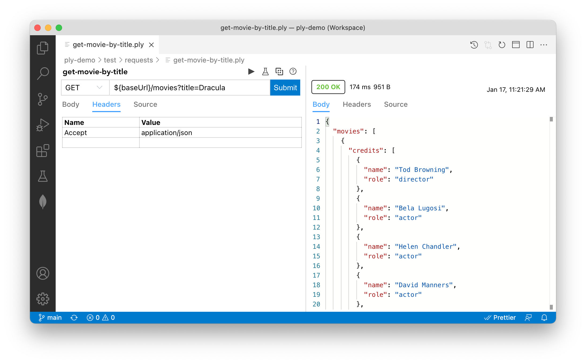

# Requests
Requests are the reusable building blocks you can arrange to create test sequences, or suites.
Each request represents an HTTP request with these elements:
  - url
  - method
  - headers
  - body

Requests are saved as YAML files. Files with the `.ply` extension contain a single request and can be edited visually
using the [Ply VS Code extension](https://marketplace.visualstudio.com/items?itemName=ply-ct.vscode-ply):


A request suite is a standard YAML file (`.yml`, `.yaml`) containing one or more named requests to be executed in sequence.
Here's an example from movie-queries.ply.yaml in the [ply-demo](https://github.com/ply-ct/ply-demo) project:
```yaml
moviesByYearAndRating:
  url: '${baseUrl}/movies?year=${year}&rating=${rating}'
  method: GET
  headers:
    Accept: application/json
```
This defines a GET request against [ply-movies](https://github.com/ply-ct/ply-movies#readme), our example API containing horror
movies from the 1930s. Our request's name, `moviesByYearAndRating`, is the top-level key. Note our use of JavaScript [template literal](https://developer.mozilla.org/en-US/docs/Web/JavaScript/Reference/Template_literals)
expressions embedded in `url`. Every element of a request can be parameterized using [Values](values).

The next request in this suite illustrates another important feature of expressions:
```yaml
movieById:
  # id comes from previous response body
  url:  '${baseUrl}/movies/${@moviesByYearAndRating.response.body.movies[0].id}'
  method: GET
  headers:
    Accept: application/json
```
Here we use special designator `@` in our URL expression to reference a runtime value from the body of the previous response.
This enables us to chain requests, embedding values from previous requests/responses in subsequent requests.

Before we move on to show how you can run your Ply request suites, a few points to keep in mind:
  - Suites are identified by their YAML file name, so there's always one suite per file
  - Suites should be self contained; expressions cannot reference runtime values from a different suite
  - During execution:
    - suites can be run in parallel by specifying the `parallel` [config option](config) 
    - but within a suite requests are always run sequentially, in declaration order

## Running
Requests can be run via [Ply CLI](cli), or within Visual Studio Code by installing the [Ply Extension]().

For now let's use the CLI to run ply-demo's movie-queries.ply.yaml request suite. First, if you haven't already,
[install Ply](install). Then clone ply-demo and run the request suite:
```
git clone https://github.com/ply-ct/ply-demo.git
cd ply-demo
npm install
ply test/requests/movie-queries.ply.yaml
```
The output indicates that all tests have passed:
```
Request 'moviesByYearAndRating' submitted at 8/29/2020, 18:26:54:981
Test 'moviesByYearAndRating' PASSED in 51 ms
Request 'movieById' submitted at 8/29/2020, 18:26:55:031
Test 'movieById' PASSED in 8 ms
Request 'moviesQuery' submitted at 8/29/2020, 18:26:55:039
Test 'moviesQuery' PASSED in 8 ms

Overall Results: {"Passed":3,"Failed":0,"Errored":0,"Pending":0,"Submitted":0}
Overall Time: 305 ms
```
To understand what it means for a request to have PASSED, continue on to [Results](results).

**Note:** Like many of these exercises, movie-queries.ply.yaml uses the [ply-movies](https://github.com/ply-ct/ply-movies#readme) sample API.

### Run a single request
Passing a file name to `ply` executes all requests in sequence. You can also run an individual request by itself:
```
ply test/requests/movie-queries.ply.yaml#moviesByYearAndRating
```

### Run without verifying
You can tell Ply to submit *ad hoc* requests without verifying results (see [CLI commands](cli#command-line-only-arguments)):
```
ply -s test/requests/movie-queries.ply.yaml
```

## GraphQL
In request YAML, `body` elements may contain any text content. For REST APIs like ply-movies, this is typically JSON.
But GraphQL syntax is also supported, as in the following example which queries the [GitHub GraphQL API](https://docs.github.com/en/graphql) 
for ply-demo repository topics: 
```yaml
repositoryTopicsQuery:
  url: 'https://api.github.com/graphql'
  method: POST
  headers:
    Authorization: Bearer ${githubToken}
    Content-Type: application/json
    User-Agent: ${github.organization}
  body: |-
    query {
      repository(owner: "${github.organization}", name: "${github.repository}") {
        repositoryTopics(first: 10) {
          edges {
            node {
              topic {
                name
              }
            }
          }
        }
      }
    }
```

Run this in ply-demo with `--verbose` to see how Ply translates GraphQL to a JSON request body:
```
ply --verbose test/requests/github-api.ply.yaml#repositoryTopicsQuery
```
You'll receive an HTTP 401 (Unauthorized) response unless you include the `githubToken` property
somewhere in your [values](values). Follow the [GitHub token guide](https://docs.github.com/en/github/authenticating-to-github/creating-a-personal-access-token)
to obtain your personal access token. This is a good candidate for your [PLY_VALUES](values#environment-variable) 
environment variable, since you don't want to share your access token in version control.

## URLEncoded Form Data
For POST requests with Accept header set to `application/x-www-form-urlencoded`, form data is displayed as a table in 
VS Code if you have the Ply extension installed. Expressions can be applied in both keys and values.


## Multipart Form Data
Here's an example showing how to upload `multipart/form-data` attachments from files:
```yaml
createAttachments:
  url: ${baseUrl}/attachments
  method: POST
  headers:
    Content-Type: multipart/form-data;boundary="--boundary"
  body: |-
    --boundary
    Content-Disposition: form-data; name="textFile"; filename="test/ply/attachments/myText.txt"
    --boundary
    Content-Disposition: form-data; name="binaryFile"; filename="test/ply/attachments/mySelfie.png"
    --boundary--
```

Next Topic: [Results](results)
