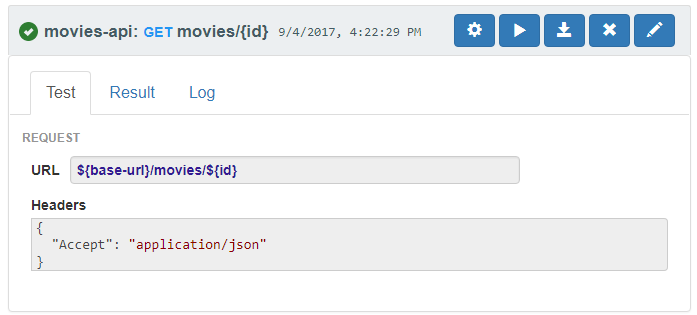

## Requests
Ply is all about automated testing of REST APIs. When executing a test, 
you'll send actual HTTP requests to exercise your services.
Every aspect of a test can be parameterized using [Values](values).

Requests are the reusable building blocks you'll arrange to create test sequences.
Each request represents an HTTP request with a parameterized endpoint, header and payload.
Ply has its own native JSON format, but the easiest way to get started is to
[create and export a collection](https://www.getpostman.com/docs/postman/collections/creating_collections) 
in [Postman](https://www.getpostman.com/).  As an example, the [ply-demo](https://github.com/ply-ct/ply-demo)
project has an exported [movies-api collection](https://github.com/ply-ct/ply-demo/blob/master/src/test/ply/movies-api.postman).

Every request in the collection can be run individually, or linked together in Ply [Cases](cases).
An intuitive way to visualize a request is through [Ply UI](https://ply-ct.com/ui/requests).
Here's what the [`GET movies/{id}`](https://ply-ct.com/ui/requests/movies-api/GET/movies/{id}) request looks like:

(Take a look at [`POST movies`](https://ply-ct.com/ui/requests/movies-api/POST/movies) for an example that includes a JSON body.)

Next Topic: [Results](results)
