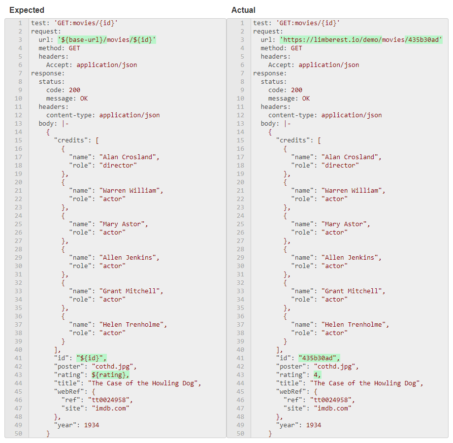

## Results
When you run a test in Ply, it generates results in [YAML](http://yaml.org/) format.  After execution, here's 
what the Result tab looks like for [`GET movies/{id}`](https://ply-ct.com/ui/requests/movies-api/GET/movies/{id}):

The green highlights indicate successful matching of runtime [Values](values).  Mismatches would cause the test to fail
and be highlighted in red.  For comparison purposes, YAML comments are ignored.

YAML gives a nicely readable rendition of the expected vs. actual result.  Notice that the result includes not only 
the response body, but also its status and headers.  If the request had a body, that would be represented as well.

The [expected result YAML](https://github.com/ply-ct/ply-demo/blob/master/src/test/ply/results/expected/movies-api/GET_movies_{id}.yaml) 
is retrieved from GitHub, where the results for all tests and cases are reposited.

Next Topic: [Values](values)
