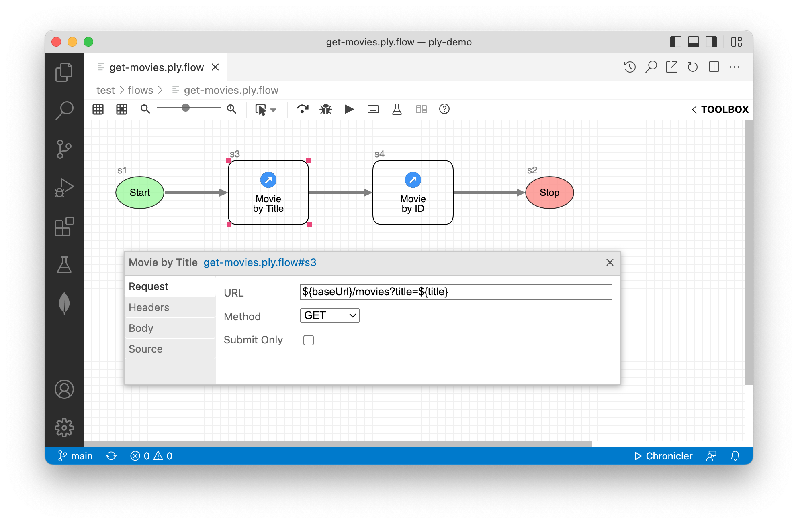
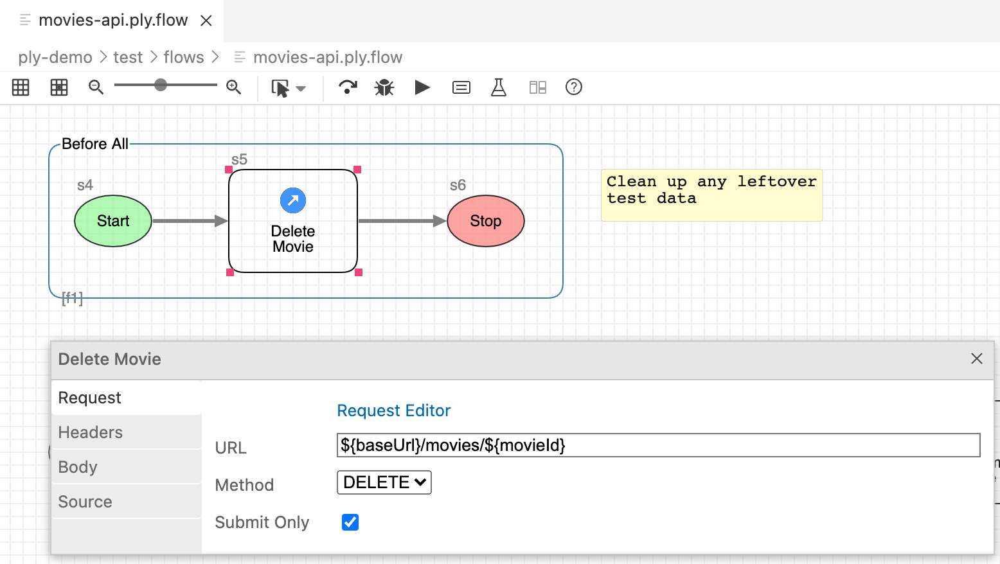
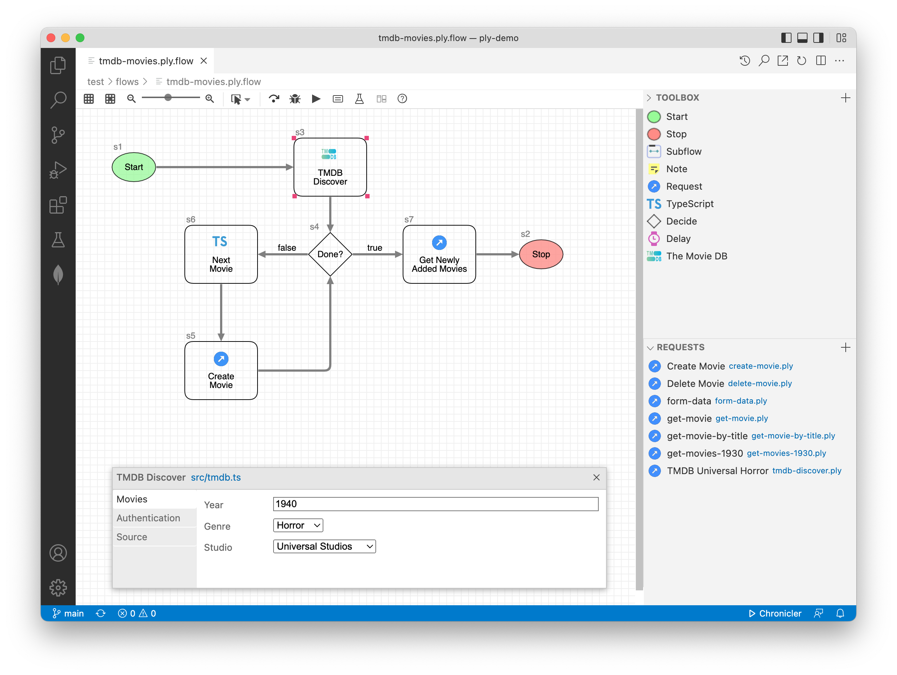

# Steps
A step in a Ply flow represents a single unit of work, most commonly a [request](requests). Adding and configuring
steps is discussed at length in the [flows](flows) walkthrough.

## Trusted contexts
Some types of steps can perform unsafe executions and must explicitly be trusted to run. For example, a
[TypeScript step](#typescript-step) in a flow from a malicious source could access your file system and compromise
security in any number of ways. To prevent this, certain steps require you to explicitly grant trusted status
in order to execute.

Granting trusted status:
  - **Ply CLI**: Pass `--trusted=true` as a [command-line](cli) argument.
  - **VS Code**: Enable [Workspace Trust](https://code.visualstudio.com/docs/editor/workspace-trust).

## Start/stop steps
When you create a new flow it includes both a Start and a Stop step. There should only be one Start step in your
flow. It appears in the toolbox in case you delete it and need to re-add. Multiple Stop steps may be needed when a
branching scenario includes two or more paths (see [Decider step](#decider-step)). Start and Stop steps have no 
functional purpose other than to indicate to the Ply engine where to start and when to stop flow execution.

## Request step
A request step sends an HTTP request to a designated endpoint and captures the response. Configuration elements
include URL, Method, Header and Body. All of these can contain parameterized [values](values).



Clicking on the configurator title link ("get-movies.ply.flow#s3" in the screenshot above) opens the request step
in Ply's request editor, for full-featured JSON/code support and convenient ad-hoc testing.

Ordinarily a request step is included in expected/actual [results](results) comparison. But the configurator 
"Submit Only" checkbox allows you to override this behavior so that its output is ignored, which can be especially 
useful in the context of setup/teardown [subflows](flows#subflows). Below we don't care whether the DELETE request
returns HTTP `404-Not Found` or `200-OK`; just that the movies is not present when our test begins.  


## Delay step
A delay step causes a flow to wait before before executing the next downstream step. The interval is configured in
milliseconds. Configured intervals can be expressions, in which case execution must be in a trusted context.

## Decider step
Decider steps control flow branching, and so can have outbound links to multiple downstream steps. A Decider is
configured with an expression, which is compared (as a string) against the labels of all outbound links to determine
flow direction. See the "Done" step in the screenshot below for an example of how this is used.

## TypeScript step
A TypeScript step executes your custom .ts module that default-exports a class implementing the 
[`PlyExec`](../../api-docs/interfaces/PlyExec.html) interface.
Here's an [example implementation](https://github.com/ply-ct/ply-demo/blob/main/src/movie.ts) from ply-demo:
```typescript
import * as ply from '@ply-ct/ply';

export default class NextMovie extends ply.PlyExecBase {

    constructor(
        readonly step: ply.FlowStep,
        readonly instance: ply.StepInstance,
        readonly logger: ply.Logger
    ) {
        super(step, instance, logger);
    }

    async run(runtime: ply.Runtime, values: any): Promise<ply.ExecResult> {
        if (Array.isArray(values.plyMovies)) {
            values.plyMovie = values.plyMovies.pop();
            return { status: 'Passed' };
        } else {
            throw new Error('Expects array value: plyMovies');
        }
    }
``` 
Notice that the `run()` method has access to read and update runtime values.

## Custom steps
You can create reusable custom steps that appear in the flow toolbox alongside Ply's built-in steps. To
invoke the custom step wizard, click the Custom Step icon at the top of the toolbox:
   

Like TypeScript steps, custom steps implement the `PlyExec` interface.
Custom steps require a JSON *descriptor* indicating how they're to be displayed and configured.
See [ply-demo's tmdb step](https://github.com/ply-ct/ply-demo/tree/main/custom/steps) for a working example.
Descriptors enable per-use configuration like this tmdb step in
[tmdb-movies.ply.flow](https://github.com/ply-ct/ply-demo/tree/main/test/flows), 
as depicted below.


## Attributes
Attributes are design-time values that reflect the per-use configuration of a step in a particular flow.
These can be read at runtime to drive custom step behavior:
```typescript
    async run(_runtime: ply.Runtime, values: any): Promise<ply.ExecResult> {
        const tmdb: { [name: string]: any } = {};
        tmdb.key = this.getAttribute('apiKey', values, {trusted, required: true});
        // ... further processing
    }
```
The `getAttribute()` method inherited from [PlyExecBase](../../api-docs/classes/PlyExecBase) automatically
substitutes expressions from runtime [values](values). 

Attribute values are always strings. Date and DateTime values are ISO-formatted. Tabular values are serialized two-dimensional arrays of strings.

Values, which differ from attributes in that they vary per runtime instance instead of per flow definition, are described in the next section.

Next Topic: [Values](values)
