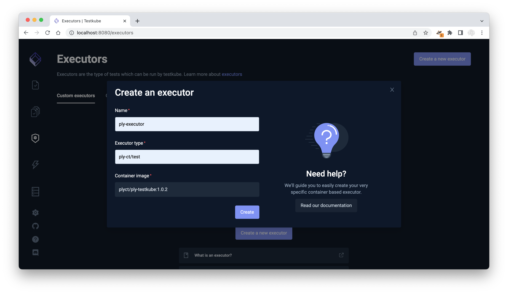

# Testkube
The Ply [Testkube](https://testkube.io/) executor is available in [Docker Hub](https://hub.docker.com/) at `plyct/ply-testkube:1.0.2`.

## Create Ply Testkube executor
```
kubectl testkube create executor --image plyct/ply-testkube:1.0.2 --types ply-ct/test --name ply-executor
```
Or use the Testkube dashboard:


## Create Ply test
```
kubectl testkube create test --name ply-demo --type ply-ct/test --git-uri https://github.com/ply-ct/ply-demo.git
```

## Run Ply test
```
kubectl testkube run test ply-demo --args "values-files=test/values/global.json,test/values/ply-ct.json npmInstall=true"
```
Some of these tests will fail because you're not allowed to post updates to ply-ct.org.  
To run specific Ply tests:
```
kubectl testkube run test ply-demo --args "values-files=test/values/global.json,test/values/ply-ct.json test-files=test/requests/movie-queries.ply.yaml,test/flows/get-movies.ply.flow"
```

<br>
Next Topic: [CLI](cli)
