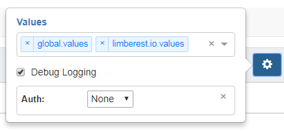

## Values
Values provide a way to repeatedly run tests with varying input.  Values files are JSON.  They can be in
[Postman environment](https://www.getpostman.com/docs/postman/environments_and_globals/manage_environments) format,
or as (simpler and preferred) straight-JSON objects.  Values can hold environment-specific parameters like these:
  - [ply-ct.com.values](https://github.com/ply-ct/ply-demo/blob/master/src/test/ply/ply-ct.com.values)
  - [localhost.values](https://github.com/ply-ct/ply-demo/blob/master/src/test/ply/localhost.values)

But values can also hold arbitrary testing data like this:
  - [global.values](https://github.com/ply-ct/ply-demo/blob/master/src/test/ply/global.values)
  
The examples in the previous topic illustrate how values are referenced in result YAML using JavaScript 
[template literal expressions](https://developer.mozilla.org/en-US/docs/Web/JavaScript/Reference/Template_literals) syntax:
```yaml
request:
  url: '${base-url}/movies/${id}' # comments are ignored
``` 
For even more powerful matching, results can contain regular expressions: 
```yaml
  headers:
    content-length: ${~[0-9]*} # any number of digits
``` 
(Actually a better way to not care about content-length is to use response header filtering as described under [Options](options).) 

In Ply UI, values are applied by selecting their JSON source file like so:



(applied from left to right like in JavaScript's 
[Object.assign()](https://developer.mozilla.org/en-US/docs/Web/JavaScript/Reference/Global_Objects/Object/assign) function).
Your values JSON does not have to be flat; it can contain nested objects referenced through expressions like `${order.customer.name.first}`. 

Feel free to apply values and try GET requests yourself in Ply's [Demo UI](https://ply-ct.com/ui/testing).
Tests execute in your browser, and results are retained in [local storage](https://developer.mozilla.org/en-US/docs/Web/API/Window/localStorage),
so nothing is saved back to the server.  Unless you install and run [ply-demo](https://github.com/ply-ct/ply-demo/blob/master/README.md)
locally, you won't be able to submit POST, PUT or DELETE requests since those require authorization.

You can even edit the request content or expected result YAML by clicking the pencil icon .

Remember: All your changes are saved in browser local storage, so experiment freely with successful and unsuccessful results.
When you graduate to creating your own tests and results, you can use Ply UI to commit and push your changes to your GitHub repository.   

Next Topic: [Cases](cases)
