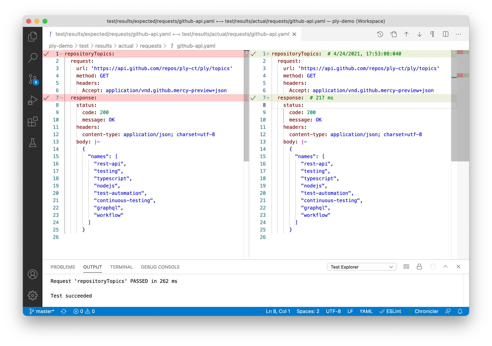
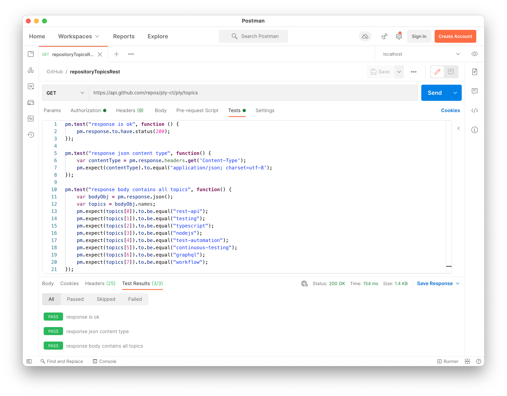
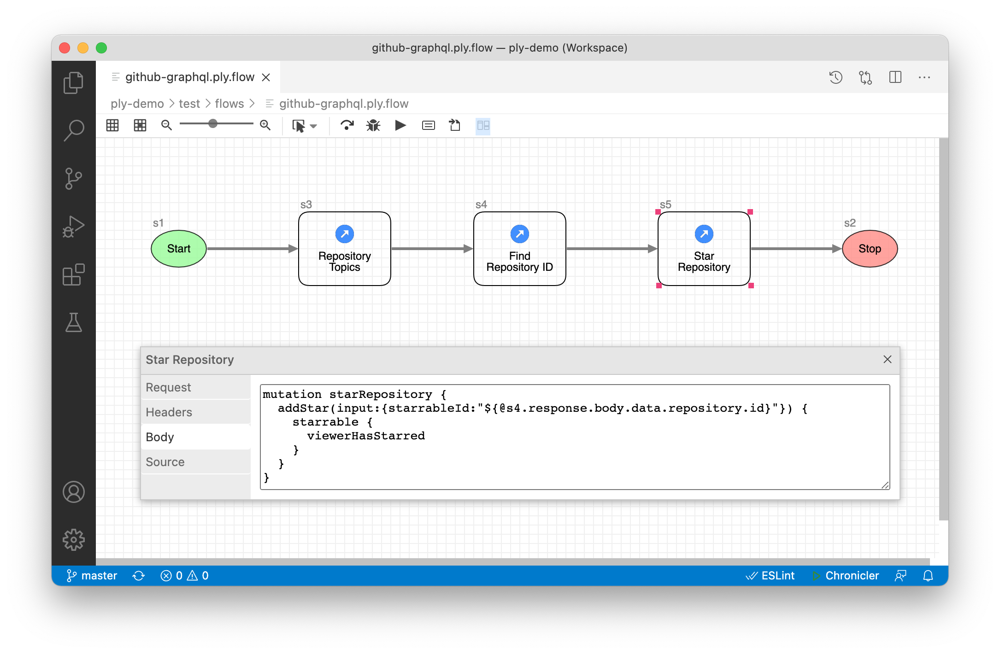

<h1>Ply is meant to be easy</h1>

We invented Ply because automated API testing should be a pleasure. Not a laborious exercise in field-by-field response validations.
If tests are easier to build, they're more likely to be comprehensive.

Postman, Insomnia and Thunder Client are awesome tools for sending HTTP requests. Where they fall short is in automated testing.
Ply is secure and open-source. No sign-up. No need to export collections for committing to Git. Artifacts are saved directly as
human-readable YAML files. Use file system folders to naturally and intuitively organize requests and flows.  

## Autotesting capabilities

|                      |Ply                     |Postman                 |Insomnia                |REST-Assured            |SOAtest                 |ReadyAPI                |
|:---------------------|:----------------------:|:----------------------:|:----------------------:|:----------------------:|:----------------------:|:----------------------:|
|Graphical Flows       |✓|✗|✗|✗|✗|✗|
|Side-by-Side Results  |✓|✗|✗|✗|✗|✗|
|Low-Code Testing      |✓|✗|✗|✗|✗|✗|
|Auto-Generate Results |✓|✗|✗|✗|✗|✗|
|GraphQL Support       |✓|✓|✓|✗|✗|✓|
|Dynamic Input Values  |✓|✓|✓|✓|✓|✓|
|Previous Response Refs|✓|✓|✓|✓|✓|✓|
|Regular Expressions   |✓|✓|✓|✓|✓|✓|
|Open Source           |✓|✗|✓|✓|✗|✗|
|Import from Postman   |✓|-|✓|✗|✓|✓|
|Expect/Assert         |✓|✓|✓|✓|✓|✓|
|VS Code Extension     |✓|✗|✗|✗|✗|✗|
|CI/CD Embeddable      |✓|✓|✗|✓|✓|✓|
|Load Tests (Parallel) |✓|✗|✗|✗|✓|✓|

 
## Comparison

For super complex scenarios, a programmatic approach may be a necessary effort (and Ply <a href="topics/cases">supports that too</a>).
But for 90% of API testing Ply's workflow-driven, declarative approach is a more maintainable alternative.

For comparison let's look at a simple example: GitHub's REST API for retrieving repository topics. Ply uses YAML for expected/actual results.

Here's what a similar test looks like in <a href="https://blog.postman.com/writing-tests-in-postman/">Postman</a>:

Notice the difference? With Ply you maintain your expected response body as an entire JSON payload embedded in YAML; whereas in Postman you'll
need to craft JavaScript to evaluate each and every element. <a href="https://support.insomnia.rest/article/194-unit-testing">Insomnia tests</a>
work much the same way as Postman. Not only are Ply tests much easier to understand, but also they can be <a href="topics/flows#run-with-expected-results">auto-generated</a>
by capturing a good response.

But what about dynamic values? Isn't JavaScript better for that? Sure it is. That's what 
<a href="https://developer.mozilla.org/en-US/docs/Web/JavaScript/Reference/Template_literals">template literals</a>
were invented for. Read about Ply's intuitive support for <a href="topics/values">dynamic expressions</a>. Most importantly, 
you'll want to reference properties from previous responses in subsequent requests. Like how 
<a href="https://github.com/ply-ct/ply-demo/blob/master/test/requests/github-api.ply.yaml#L45">ply-demo's starRepository</a>
GraphQL query cites the <code class="highlighter-rouge">id</code> grabbed by its upstream findRespositoryId request:
<pre class="highlight"><code>${@findRepositoryId.response.body.data.repository.id}</code></pre>
This way you can string together requests into a workflow, either declaratively in a <a href="topics/requests">YAML request suite</a>,
or graphically in a <a href="topics/flows">Ply flow</a>.

